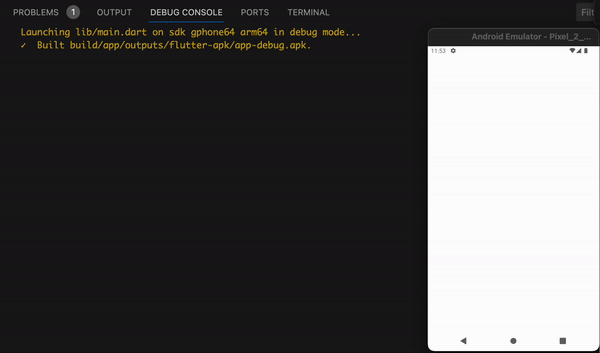
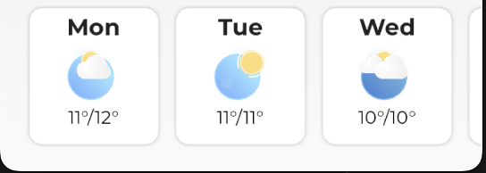
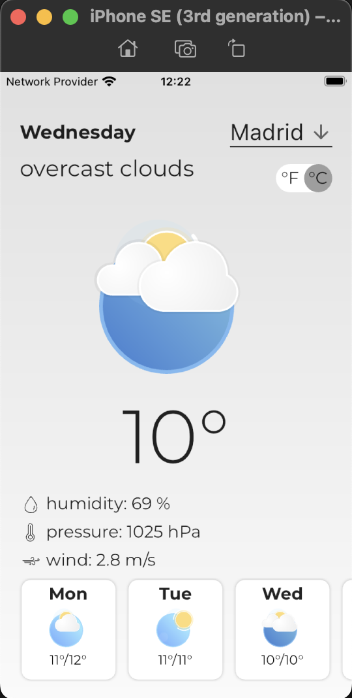
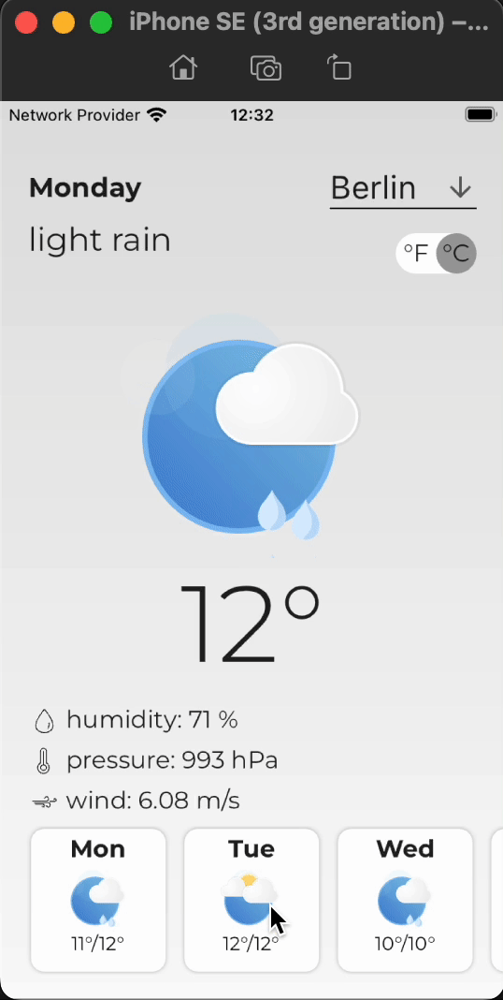
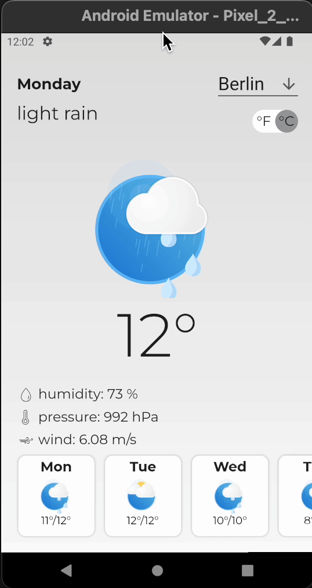
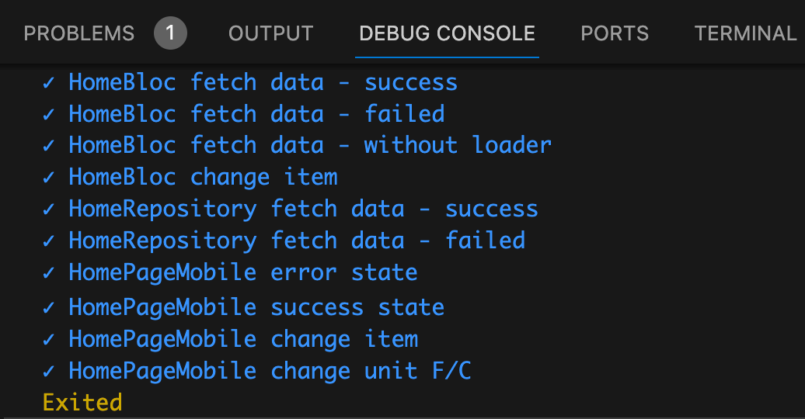

# Weather forecast 

### Acceptance criterias  

- loading indicator is displayed when fetching the data  

  

- weather list item contains the day of the week abbreviation, weather condition image  

  

- weather details contain the day of the week, weather condition name and image,
current temperature, humidity, pressure, and wind  

  

- selecting a whether list item updates the details  

  

- weather information can be refreshed with pull to refresh gesture  

  

 - error screen with a retry button is shown when fetching the data fails (for example SocketException) 

  

### Extra points  

- supporting horizontal and vertical layouts  

  

- changing the temperature’s unit (C/F)  

  

### Additional  

- opportunity to choose the city  

  

- web version support  

  

- add tests  

  

